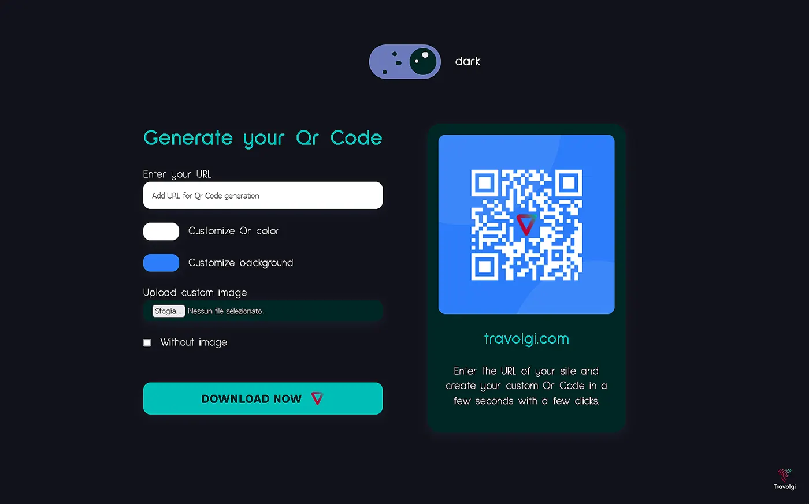

# Qr Code Generator with color theme switcher

This app generates Qr Code based on the entered URL. It is also possible to customize and download the generated Qr Code




## Table of contents

- [About App](#about-app)
- [Process](#process)
  - [Built with](#built-with)
  - [Useful resources](#useful-resources)
- [Getting Started](#getting-started)
  - [System Requirements](#system-requirements)
  - [Installation](#installation)
  - [Bugs](#bugs)
  - [Contributing](#contributing)
- [License](#license)

## About App

This app generates Qr Code based on the url entered


Features:
- Light / dark mode theme switcher
- Qr Code 'travolgi.com' default on loading
- Dynamically generating the Qr Code as you type the URL
- Dynamically update the color and background of the Qr Code based on the customization input entered by the user
- Dynamically update the customized image of the Qr Code
- Removes the custom image of the Qr Code
- You can download the `.png` of the generated Qr Code

## Process

### Built with

- Semantic HTML5 markup
- CSS custom properties
- Grid & Flexbox
- [React](https://reactjs.org/) - Js library
- [QRCode.react](https://www.npmjs.com/package/qrcode.react) - Qr Code package
- [React Color](https://casesandberg.github.io/react-color/) - Color Pickers package

### Useful resources

- [QRCode.react](https://www.npmjs.com/package/qrcode.react)
- [React Color](https://casesandberg.github.io/react-color/)

## Getting Started

In order to view this project locally, you need to make sure you clone this repository and install it's dependencies.

### System Requirements

- [git][https://git-scm.com/] 2.31.1 or greater
- [node][https://nodejs.org/en/] 14.16.1 or greater
- [npm][https://nodejs.org/en/] 8.7.0 or greater

To check which versions you have installed you can run these commands:
```
git --version
node --version
npm --version
```
If requirements above are not installed in your computer, you'll need to install them. By clicking on them you can go to their website, which can lead you the way.

### Installation

- Clone the repository
  ```sh
  git clone https://github.com/travolgi/react-qrcode-generator.git
  ```
- Navigate to repository folder
  ```sh
  cd react-qrcode-generator
  ```
- Install npm packages
  ```sh
  npm install
  ```
- To run the app in the development mode run in the project directory: 
  ```sh
  npm start
  ```

### Bugs

Please feel free to create an issue if you see a bug or something unexpected in the app.

### Contributing

- Fork the Project
- Create your Feature Branch (`git checkout -b feature/yourFeature`)
- Commit your Changes (`git commit -m 'Brief explanation of feature`')
- Push to the Branch (`git push origin feature/yourFeature`)
- Open a Pull Request

## License 
[MIT license](https://github.com/travolgi/react-qrcode-generator/blob/master/LICENSE)